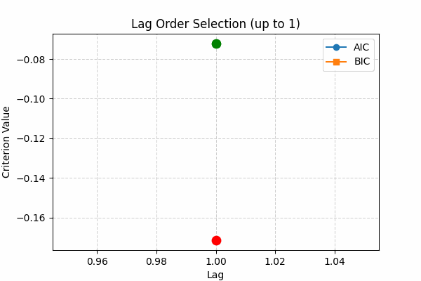

# Lag Selection Visualizer

A Python tool to **visualize and compare lag order selection** for multivariate time series models using **AIC** (Akaike Information Criterion) and **BIC** (Bayesian Information Criterion). 

---

# Features
- Computes AIC and BIC values for different lag orders in **VAR (Vector Autoregression)** models.
- Highlights the **best lag order** based on each criterion.
   
